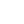

# @l-you

A Full-Stack Web Engineer generating revenue since 2018. Hardened by tons of legacy code.

## My Philosophy

- **KISS Principle** · "Keep It Simple, Stupid!". Building straightforward solutions that are easy to understand and maintain, avoiding unnecessary complexity.
- **UI/UX Focus** · Crafting simple, eye-friendly UI and delivering a smooth UX. Every pixel matters.
- **Innovation Driven** · Replacing outdated code with cutting-edge technologies.
- **Codebase Rescuer** · Solving problems nobody wants to solve.
- **Details Matter** · Paying attention to small details which, as practice shows, increase the conversion rate significantly.
- **Lifestyle & Software** · Learning a variety of skills in life enables the brain to create better software solutions.

<picture>
   <source srcset="https://github-readme-stats-steel-omega.vercel.app/api?username=l-you&show_icons=true&hide=stars&show=discussions_started,discussions_answered,prs_merged,prs_merged_percentage&include_all_commits=true" media="(prefers-color-scheme: light)">
  

</picture>
<picture>
	<source srcset="https://github-readme-stats-steel-omega.vercel.app/api/top-langs/?username=l-you&langs_count=6" media="(prefers-color-scheme: light)">
  	
</picture>

## Technologies I've Worked With

### Programming Languages

<table><tbody><tr>
<td align="center" valign="middle">
				 <a href="https://www.php.net/" target="_blank" align="center" rel="noopener noreferrer">
					<picture>	
						<source srcset="./icons/dark/php.svg" media="(prefers-color-scheme: dark)">
					 	
					</picture>
				 </a> 
				<a href="https://www.php.net/" target="_blank" align="center" rel="noopener noreferrer">&nbsp;PHP&nbsp;</a>
</td>
<td align="center" valign="middle">
				 <a href="https://go.dev/" target="_blank" align="center" rel="noopener noreferrer">
					<picture>
						<source srcset="./icons/dark/go.svg" media="(prefers-color-scheme: dark)">
					 	
					</picture>
				 </a> 
				<a href="https://go.dev/" target="_blank" align="center" rel="noopener noreferrer">&nbsp;&nbsp;Go&nbsp;&nbsp;</a>
</td>
<td align="center" valign="middle">
				 <a href="https://developer.mozilla.org/en-US/docs/Web/JavaScript" target="_blank" align="center" rel="noopener noreferrer">
					<picture>
						<source srcset="./icons/dark/javascript.svg" media="(prefers-color-scheme: dark)">
					 	
					</picture>
				 </a> 
				<a href="https://developer.mozilla.org/en-US/docs/Web/JavaScript" target="_blank" align="center" rel="noopener noreferrer">JavaScript</a>
</td>
<td align="center" valign="middle">
				 <a href="https://www.typescriptlang.org/" target="_blank" align="center" rel="noopener noreferrer">
					<picture>
						<source srcset="./icons/dark/typescript.svg" media="(prefers-color-scheme: dark)">
					 	
					</picture>
				 </a> 
				<a href="https://www.typescriptlang.org/" target="_blank" align="center" rel="noopener noreferrer">TypeScript</a>
</td>
<td align="center" valign="middle">
				 <a href="https://www.rust-lang.org/" target="_blank" align="center" rel="noopener noreferrer">
					<picture>
						<source srcset="./icons/dark/rust.svg" media="(prefers-color-scheme: dark)">
					 	
					</picture>
				 </a> 
				<a href="https://www.rust-lang.org/" target="_blank" align="center" rel="noopener noreferrer">&nbsp;Rust&nbsp;</a>
</td>
<td align="center" valign="middle">
				 <a href="https://www.gnu.org/software/bash/" target="_blank" align="center" rel="noopener noreferrer">
					<picture>
						<source srcset="./icons/dark/gnubash.svg" media="(prefers-color-scheme: dark)">
					 	
					</picture>
				 </a> 
				<a href="https://www.gnu.org/software/bash/" target="_blank" align="center" rel="noopener noreferrer">Gnubash</a>
</td>
<td align="center" valign="middle">
				 <a href="https://developers.google.com/apps-script" target="_blank" align="center" rel="noopener noreferrer">
					<picture>
						<source srcset="./icons/dark/googleappsscript.svg" media="(prefers-color-scheme: dark)">
					 	
					</picture>
				 </a> 
				<a href="https://developers.google.com/apps-script" target="_blank" align="center" rel="noopener noreferrer">Google Apps Script</a>
</td>
<td align="center" valign="middle">
				 <a href="https://en.wikipedia.org/wiki/Unix_shell" target="_blank" align="center" rel="noopener noreferrer">
					<picture>
						<source srcset="./icons/dark/shell.svg" media="(prefers-color-scheme: dark)">
					 	
					</picture>
				 </a> 
				<a href="https://en.wikipedia.org/wiki/Unix_shell" target="_blank" align="center" rel="noopener noreferrer">Shell</a>
</td>
</tr></tbody></table>

### Frontend Development

<table><tbody><tr>
<td align="center" valign="middle">
				 <a href="https://react.dev/" target="_blank" align="center" rel="noopener noreferrer">
					<picture>
						<source srcset="./icons/dark/react.svg" media="(prefers-color-scheme: dark)">
					 	
					</picture>
				 </a> 
				<a href="https://react.dev/" target="_blank" align="center" rel="noopener noreferrer">React</a>
</td>
<td align="center" valign="middle">
				 <a href="https://nextjs.org/" target="_blank" align="center" rel="noopener noreferrer">
					<picture>
						<source srcset="./icons/dark/nextdotjs.svg" media="(prefers-color-scheme: dark)">
					 	
					</picture>
				 </a> 
				<a href="https://nextjs.org/" target="_blank" align="center" rel="noopener noreferrer">Next.js</a>
</td>
<td align="center" valign="middle">
				 <a href="https://ui.shadcn.dev/" target="_blank" align="center" rel="noopener noreferrer">
					<picture>
						<source srcset="./icons/dark/shadcnui.svg" media="(prefers-color-scheme: dark)">
					 	
					</picture>
				 </a> 
				<a href="https://ui.shadcn.dev/" target="_blank" align="center" rel="noopener noreferrer">Shadcn UI</a>
</td>
<td align="center" valign="middle">
				 <a href="https://mui.com/" target="_blank" align="center" rel="noopener noreferrer">
					<picture>
						<source srcset="./icons/dark/mui.svg" media="(prefers-color-scheme: dark)">
					 	
					</picture>
				 </a> 
				<a href="https://mui.com/" target="_blank" align="center" rel="noopener noreferrer">&nbsp;MUI&nbsp;</a>
</td>
<td align="center" valign="middle">
				 <a href="https://tailwindcss.com/" target="_blank" align="center" rel="noopener noreferrer">
					<picture>
						<source srcset="./icons/dark/tailwindcss.svg" media="(prefers-color-scheme: dark)">
					 	
					</picture>
				 </a> 
				<a href="https://tailwindcss.com/" target="_blank" align="center" rel="noopener noreferrer">Tailwind CSS</a>
</td>
<td align="center" valign="middle">
				 <a href="https://developer.mozilla.org/en-US/docs/Web/Guide/HTML/HTML5" target="_blank" align="center" rel="noopener noreferrer">
					<picture>
						<source srcset="./icons/dark/html5.svg" media="(prefers-color-scheme: dark)">
					 	
					</picture>
				 </a> 
				<a href="https://developer.mozilla.org/en-US/docs/Web/Guide/HTML/HTML5" target="_blank" align="center" rel="noopener noreferrer">HTML5</a>
</td>
<td align="center" valign="middle">
				 <a href="https://developer.mozilla.org/en-US/docs/Web/CSS" target="_blank" align="center" rel="noopener noreferrer">
					<picture>
						<source srcset="./icons/dark/css3.svg" media="(prefers-color-scheme: dark)">
					 	
					</picture>
				 </a> 
				<a href="https://developer.mozilla.org/en-US/docs/Web/CSS" target="_blank" align="center" rel="noopener noreferrer">&nbsp;CSS3&nbsp;</a>
</td>
<td align="center" valign="middle">
				 <a href="https://sass-lang.com/" target="_blank" align="center" rel="noopener noreferrer">
					<picture>
						<source srcset="./icons/dark/sass.svg" media="(prefers-color-scheme: dark)">
					 	
					</picture>
				 </a> 
				<a href="https://sass-lang.com/" target="_blank" align="center" rel="noopener noreferrer">&nbsp;SASS&nbsp;</a>
</td>
<td align="center" valign="middle">
				 <a href="https://github.com/css-modules/css-modules" target="_blank" align="center" rel="noopener noreferrer">
					<picture>
						<source srcset="./icons/dark/cssmodules.svg" media="(prefers-color-scheme: dark)">
					 	
					</picture>
				 </a> 
				<a href="https://github.com/css-modules/css-modules" target="_blank" align="center" rel="noopener noreferrer">CSS Modules</a>
</td>
<td align="center" valign="middle">
				 <a href="https://purgecss.com/" target="_blank" align="center" rel="noopener noreferrer">
					<picture>
						<source srcset="./icons/dark/purgecss.svg" media="(prefers-color-scheme: dark)">
					 	
					</picture>
				 </a> 
				<a href="https://purgecss.com/" target="_blank" align="center" rel="noopener noreferrer">PurgeCSS</a>
</td>
<td align="center" valign="middle">
				 <a href="https://postcss.org/" target="_blank" align="center" rel="noopener noreferrer">
					<picture>
						<source srcset="./icons/dark/postcss.svg" media="(prefers-color-scheme: dark)">
					 	
					</picture>
				 </a> 
				<a href="https://postcss.org/" target="_blank" align="center" rel="noopener noreferrer">PostCSS</a>
</td>
<td align="center" valign="middle">
				 <a href="https://github.com/postcss/autoprefixer" target="_blank" align="center" rel="noopener noreferrer">
					<picture>
						<source srcset="./icons/dark/autoprefixer.svg" media="(prefers-color-scheme: dark)">
					 	
					</picture>
				 </a> 
				<a href="https://github.com/postcss/autoprefixer" target="_blank" align="center" rel="noopener noreferrer">Autoprefixer</a>
</td>
<td align="center" valign="middle">
				 <a href="https://web.dev/progressive-web-apps/" target="_blank" align="center" rel="noopener noreferrer">
					<picture>
						<source srcset="./icons/dark/pwa.svg" media="(prefers-color-scheme: dark)">
					 	
					</picture>
				 </a> 
				<a href="https://web.dev/progressive-web-apps/" target="_blank" align="center" rel="noopener noreferrer">&nbsp;PWA&nbsp;</a>
</td>
<td align="center" valign="middle">
				 <a href="https://react-hook-form.com/" target="_blank" align="center" rel="noopener noreferrer">
					<picture>
						<source srcset="./icons/dark/reacthookform.svg" media="(prefers-color-scheme: dark)">
					 	
					</picture>
				 </a> 
				<a href="https://react-hook-form.com/" target="_blank" align="center" rel="noopener noreferrer">React Hook Form</a>
</td>
<td align="center" valign="middle">
				 <a href="https://lucide.dev/" target="_blank" align="center" rel="noopener noreferrer">
					<picture>
						<source srcset="./icons/dark/lucide.svg" media="(prefers-color-scheme: dark)">
					 	
					</picture>
				 </a> 
				<a href="https://lucide.dev/" target="_blank" align="center" rel="noopener noreferrer">Lucide Icons</a>
</td>
<td align="center" valign="middle">
				 <a href="https://simpleicons.org/" target="_blank" align="center" rel="noopener noreferrer">
					<picture>
						<source srcset="./icons/dark/simpleicons.svg" media="(prefers-color-scheme: dark)">
					 	
					</picture>
				 </a> 
				<a href="https://simpleicons.org/" target="_blank" align="center" rel="noopener noreferrer">Simple Icons</a>
</td>
</tr></tbody></table>

### Backend Development

<table><tbody><tr>
<td align="center" valign="middle">
				 <a href="https://symfony.com/" target="_blank" align="center" rel="noopener noreferrer">
					<picture>
						<source srcset="./icons/dark/symfony.svg" media="(prefers-color-scheme: dark)">
					 	
					</picture>
				 </a> 
				<a href="https://symfony.com/" target="_blank" align="center" rel="noopener noreferrer">Symfony</a>
</td>
<td align="center" valign="middle">
				 <a href="https://nodejs.org/" target="_blank" align="center" rel="noopener noreferrer">
					<picture>
						<source srcset="./icons/dark/nodedotjs.svg" media="(prefers-color-scheme: dark)">
					 	
					</picture>
				 </a> 
				<a href="https://nodejs.org/" target="_blank" align="center" rel="noopener noreferrer">Node.js</a>
</td>
<td align="center" valign="middle">
				 <a href="https://payloadcms.com/" target="_blank" align="center" rel="noopener noreferrer">
					<picture>
						<source srcset="./icons/dark/payloadcms.svg" media="(prefers-color-scheme: dark)">
					 	
					</picture>
				 </a> 
				<a href="https://payloadcms.com/" target="_blank" align="center" rel="noopener noreferrer">Payload CMS</a>
</td>
<td align="center" valign="middle">
				 <a href="https://graphql.org/" target="_blank" align="center" rel="noopener noreferrer">
					<picture>
						<source srcset="./icons/dark/graphql.svg" media="(prefers-color-scheme: dark)">
					 	
					</picture>
				 </a> 
				<a href="https://graphql.org/" target="_blank" align="center" rel="noopener noreferrer">GraphQL</a>
</td>
<td align="center" valign="middle">
				 <a href="https://www.apollographql.com/" target="_blank" align="center" rel="noopener noreferrer">
					<picture>
						<source srcset="./icons/dark/apollographql.svg" media="(prefers-color-scheme: dark)">
					 	
					</picture>
				 </a> 
				<a href="https://www.apollographql.com/" target="_blank" align="center" rel="noopener noreferrer">Apollo GraphQL</a>
</td>
<td align="center" valign="middle">
				 <a href="https://gin-gonic.com/" target="_blank" align="center" rel="noopener noreferrer">
					<picture>
						<source srcset="./icons/dark/gin.svg" media="(prefers-color-scheme: dark)">
					 	
					</picture>
				 </a> 
				<a href="https://gin-gonic.com/" target="_blank" align="center" rel="noopener noreferrer">&nbsp;Gin&nbsp;</a>
</td>
<td align="center" valign="middle">
				 <a href="https://www.openapis.org/" target="_blank" align="center" rel="noopener noreferrer">
					<picture>
						<source srcset="./icons/dark/openapiinitiative.svg" media="(prefers-color-scheme: dark)">
					 	
					</picture>
				 </a> 
				<a href="https://www.openapis.org/" target="_blank" align="center" rel="noopener noreferrer">OpenAPI Initiative</a>
</td>
</tr></tbody></table>

### Databases & Caching

<table><tbody><tr>
<td align="center" valign="middle">
				 <a href="https://www.mysql.com/" target="_blank" align="center" rel="noopener noreferrer">
					<picture>
						<source srcset="./icons/dark/mysql.svg" media="(prefers-color-scheme: dark)">
					 	
					</picture>
				 </a> 
				<a href="https://www.mysql.com/" target="_blank" align="center" rel="noopener noreferrer">MySQL</a>
</td>
<td align="center" valign="middle">
				 <a href="https://mariadb.org/" target="_blank" align="center" rel="noopener noreferrer">
					<picture>
						<source srcset="./icons/dark/mariadb.svg" media="(prefers-color-scheme: dark)">
					 	
					</picture>
				 </a> 
				<a href="https://mariadb.org/" target="_blank" align="center" rel="noopener noreferrer">MariaDB</a>
</td>
<td align="center" valign="middle">
				 <a href="https://redis.io/" target="_blank" align="center" rel="noopener noreferrer">
					<picture>
						<source srcset="./icons/dark/redis.svg" media="(prefers-color-scheme: dark)">
					 	
					</picture>
				 </a> 
				<a href="https://redis.io/" target="_blank" align="center" rel="noopener noreferrer">Redis</a>
</td>
<td align="center" valign="middle">
				 <a href="https://www.meilisearch.com/" target="_blank" align="center" rel="noopener noreferrer">
					<picture>
						<source srcset="./icons/dark/meilisearch.svg" media="(prefers-color-scheme: dark)">
					 	
					</picture>
				 </a> 
				<a href="https://www.meilisearch.com/" target="_blank" align="center" rel="noopener noreferrer">Meilisearch</a>
</td>
<td align="center" valign="middle">
				 <a href="https://www.postgresql.org/" target="_blank" align="center" rel="noopener noreferrer">
					<picture>
						<source srcset="./icons/dark/postgresql.svg" media="(prefers-color-scheme: dark)">
					 	
					</picture>
				 </a> 
				<a href="https://www.postgresql.org/" target="_blank" align="center" rel="noopener noreferrer">PostgreSQL</a>
</td>
<td align="center" valign="middle">
				 <a href="https://www.mongodb.com/" target="_blank" align="center" rel="noopener noreferrer">
					<picture>
						<source srcset="./icons/dark/mongodb.svg" media="(prefers-color-scheme: dark)">
					 	
					</picture>
				 </a> 
				<a href="https://www.mongodb.com/" target="_blank" align="center" rel="noopener noreferrer">MongoDB</a>
</td>
<td align="center" valign="middle">
				 <a href="https://surrealdb.com/" target="_blank" align="center" rel="noopener noreferrer">
					<picture>
						<source srcset="./icons/dark/surrealdb.svg" media="(prefers-color-scheme: dark)">
					 	
					</picture>
				 </a> 
				<a href="https://surrealdb.com/" target="_blank" align="center" rel="noopener noreferrer">SurrealDB</a>
</td>
<td align="center" valign="middle">
				 <a href="https://supabase.com/" target="_blank" align="center" rel="noopener noreferrer">
					<picture>
						<source srcset="./icons/dark/supabase.svg" media="(prefers-color-scheme: dark)">
					 	
					</picture>
				 </a> 
				<a href="https://supabase.com/" target="_blank" align="center" rel="noopener noreferrer">Supabase</a>
</td>
<td align="center" valign="middle">
				 <a href="https://www.phpmyadmin.net/" target="_blank" align="center" rel="noopener noreferrer">
					<picture>
						<source srcset="./icons/dark/phpmyadmin.svg" media="(prefers-color-scheme: dark)">
					 	
					</picture>
				 </a> 
				<a href="https://www.phpmyadmin.net/" target="_blank" align="center" rel="noopener noreferrer">phpMyAdmin</a>
</td>
</tr></tbody></table>

### DevOps, Infrastructure & Hosting

<table><tbody><tr>
<td align="center" valign="middle">
				 <a href="https://www.docker.com/" target="_blank" align="center" rel="noopener noreferrer">
					<picture>
						<source srcset="./icons/dark/docker.svg" media="(prefers-color-scheme: dark)">
					 	
					</picture>
				 </a> 
				<a href="https://www.docker.com/" target="_blank" align="center" rel="noopener noreferrer">Docker</a>
</td>
<td align="center" valign="middle">
				 <a href="https://traefik.io/traefik/" target="_blank" align="center" rel="noopener noreferrer">
					<picture>
						<source srcset="./icons/dark/traefikproxy.svg" media="(prefers-color-scheme: dark)">
					 	
					</picture>
				 </a> 
				<a href="https://traefik.io/traefik/" target="_blank" align="center" rel="noopener noreferrer">Traefik Proxy</a>
</td>
<td align="center" valign="middle">
				 <a href="https://nginx.org/" target="_blank" align="center" rel="noopener noreferrer">
					<picture>
						<source srcset="./icons/dark/nginx.svg" media="(prefers-color-scheme: dark)">
					 	
					</picture>
				 </a> 
				<a href="https://nginx.org/" target="_blank" align="center" rel="noopener noreferrer">Nginx</a>
</td>
<td align="center" valign="middle">
				 <a href="https://www.cloudflare.com/" target="_blank" align="center" rel="noopener noreferrer">
					<picture>
						<source srcset="./icons/dark/cloudflare.svg" media="(prefers-color-scheme: dark)">
					 	
					</picture>
				 </a> 
				<a href="https://www.cloudflare.com/" target="_blank" align="center" rel="noopener noreferrer">Cloudflare</a>
</td>
<td align="center" valign="middle">
				 <a href="https://github.com/features/actions" target="_blank" align="center" rel="noopener noreferrer">
					<picture>
						<source srcset="./icons/dark/githubactions.svg" media="(prefers-color-scheme: dark)">
					 	
					</picture>
				 </a> 
				<a href="https://github.com/features/actions" target="_blank" align="center" rel="noopener noreferrer">Github Actions</a>
</td>
<td align="center" valign="middle">
				 <a href="https://evilmartians.com/chronicles/lefthook-automate-your-git-hooks" target="_blank" align="center" rel="noopener noreferrer">
					<picture>
						<source srcset="./icons/dark/lefthook.svg" media="(prefers-color-scheme: dark)">
					 	
					</picture>
				 </a> 
				<a href="https://evilmartians.com/chronicles/lefthook-automate-your-git-hooks" target="_blank" align="center" rel="noopener noreferrer">Lefthook</a>
</td>
<td align="center" valign="middle">
				 <a href="https://podman.io/" target="_blank" align="center" rel="noopener noreferrer">
					<picture>
						<source srcset="./icons/dark/podman.svg" media="(prefers-color-scheme: dark)">
					 	
					</picture>
				 </a> 
				<a href="https://podman.io/" target="_blank" align="center" rel="noopener noreferrer">Podman</a>
</td>
<td align="center" valign="middle">
				 <a href="https://letsencrypt.org/" target="_blank" align="center" rel="noopener noreferrer">
					<picture>
						<source srcset="./icons/dark/letsencrypt.svg" media="(prefers-color-scheme: dark)">
					 	
					</picture>
				 </a> 
				<a href="https://letsencrypt.org/" target="_blank" align="center" rel="noopener noreferrer">Let's Encrypt</a>
</td>
<td align="center" valign="middle">
				 <a href="https://www.openssl.org/" target="_blank" align="center" rel="noopener noreferrer">
					<picture>
						<source srcset="./icons/dark/openssl.svg" media="(prefers-color-scheme: dark)">
					 	
					</picture>
				 </a> 
				<a href="https://www.openssl.org/" target="_blank" align="center" rel="noopener noreferrer">OpenSSL</a>
</td>
<td align="center" valign="middle">
				 <a href="https://turbo.build/repo" target="_blank" align="center" rel="noopener noreferrer">
					<picture>
						<source srcset="./icons/dark/turborepo.svg" media="(prefers-color-scheme: dark)">
					 	
					</picture>
				 </a> 
				<a href="https://turbo.build/repo" target="_blank" align="center" rel="noopener noreferrer">Turborepo</a>
</td>
<td align="center" valign="middle">
				 <a href="https://brew.sh/" target="_blank" align="center" rel="noopener noreferrer">
					<picture>
						<source srcset="./icons/dark/homebrew.svg" media="(prefers-color-scheme: dark)">
					 	
					</picture>
				 </a> 
				<a href="https://brew.sh/" target="_blank" align="center" rel="noopener noreferrer">Homebrew</a>
</td>
</tr></tbody></table>

### Version Control & Collaboration

<table><tbody><tr>
<td align="center" valign="middle">
				 <a href="https://github.com/" target="_blank" align="center" rel="noopener noreferrer">
					<picture>
						<source srcset="./icons/dark/github.svg" media="(prefers-color-scheme: dark)">
					 	
					</picture>
				 </a> 
				<a href="https://github.com/" target="_blank" align="center" rel="noopener noreferrer">GitHub</a>
</td>
<td align="center" valign="middle">
				 <a href="https://gitlab.com/" target="_blank" align="center" rel="noopener noreferrer">
					<picture>
						<source srcset="./icons/dark/gitlab.svg" media="(prefers-color-scheme: dark)">
					 	
					</picture>
				 </a> 
				<a href="https://gitlab.com/" target="_blank" align="center" rel="noopener noreferrer">GitLab</a>
</td>
</tr></tbody></table>

### Package Managers & Registries

<table><tbody><tr>
<td align="center" valign="middle">
				 <a href="https://www.npmjs.com/" target="_blank" align="center" rel="noopener noreferrer">
					<picture>
						<source srcset="./icons/dark/npm.svg" media="(prefers-color-scheme: dark)">
					 	
					</picture>
				 </a> 
				<a href="https://www.npmjs.com/" target="_blank" align="center" rel="noopener noreferrer">&nbsp;npm&nbsp;</a>
</td>
<td align="center" valign="middle">
				 <a href="https://pnpm.io/" target="_blank" align="center" rel="noopener noreferrer">
					<picture>
						<source srcset="./icons/dark/pnpm.svg" media="(prefers-color-scheme: dark)">
					 	
					</picture>
				 </a> 
				<a href="https://pnpm.io/" target="_blank" align="center" rel="noopener noreferrer">&nbsp;pnpm&nbsp;</a>
</td>
<td align="center" valign="middle">
				 <a href="https://yarnpkg.com/" target="_blank" align="center" rel="noopener noreferrer">
					<picture>
						<source srcset="./icons/dark/yarn.svg" media="(prefers-color-scheme: dark)">
					 	
					</picture>
				 </a> 
				<a href="https://yarnpkg.com/" target="_blank" align="center" rel="noopener noreferrer">&nbsp;yarn&nbsp;</a>
</td>
<td align="center" valign="middle">
				 <a href="https://packagist.org/" target="_blank" align="center" rel="noopener noreferrer">
					<picture>
						<source srcset="./icons/dark/packagist.svg" media="(prefers-color-scheme: dark)">
					 	
					</picture>
				 </a> 
				<a href="https://packagist.org/" target="_blank" align="center" rel="noopener noreferrer">Packagist</a>
</td>
</tr></tbody></table>

### CMS & E-commerce

<table><tbody><tr>
<td align="center" valign="middle">
				 <a href="https://wordpress.org/" target="_blank" align="center" rel="noopener noreferrer">
					<picture>
						<source srcset="./icons/dark/wordpress.svg" media="(prefers-color-scheme: dark)">
					 	
					</picture>
				 </a> 
				<a href="https://wordpress.org/" target="_blank" align="center" rel="noopener noreferrer">WordPress</a>
</td>
<td align="center" valign="middle">
				 <a href="https://www.shopify.com/" target="_blank" align="center" rel="noopener noreferrer">
					<picture>
						<source srcset="./icons/dark/shopify.svg" media="(prefers-color-scheme: dark)">
					 	
					</picture>
				 </a> 
				<a href="https://www.shopify.com/" target="_blank" align="center" rel="noopener noreferrer">Shopify</a>
</td>
<td align="center" valign="middle">
				 <a href="https://woocommerce.com/" target="_blank" align="center" rel="noopener noreferrer">
					<picture>
						<source srcset="./icons/dark/woocommerce.svg" media="(prefers-color-scheme: dark)">
					 	
					</picture>
				 </a> 
				<a href="https://woocommerce.com/" target="_blank" align="center" rel="noopener noreferrer">WooCommerce</a>
</td>
<td align="center" valign="middle">
				 <a href="https://www.contentful.com/" target="_blank" align="center" rel="noopener noreferrer">
					<picture>
						<source srcset="./icons/dark/contentful.svg" media="(prefers-color-scheme: dark)">
					 	
					</picture>
				 </a> 
				<a href="https://www.contentful.com/" target="_blank" align="center" rel="noopener noreferrer">Contentful</a>
</td>
</tr></tbody></table>

### Utilities & Tools

<table><tbody><tr>
<td align="center" valign="middle">
				 <a href="https://prettier.io/" target="_blank" align="center" rel="noopener noreferrer">
					<picture>
						<source srcset="./icons/dark/prettier.svg" media="(prefers-color-scheme: dark)">
					 	
					</picture>
				 </a> 
				<a href="https://prettier.io/" target="_blank" align="center" rel="noopener noreferrer">Prettier</a>
</td>
<td align="center" valign="middle">
				 <a href="https://eslint.org/" target="_blank" align="center" rel="noopener noreferrer">
					<picture>
						<source srcset="./icons/dark/eslint.svg" media="(prefers-color-scheme: dark)">
					 	
					</picture>
				 </a> 
				<a href="https://eslint.org/" target="_blank" align="center" rel="noopener noreferrer">ESLint</a>
</td>
<td align="center" valign="middle">
				 <a href="https://webpack.js.org/" target="_blank" align="center" rel="noopener noreferrer">
					<picture>
						<source srcset="./icons/dark/webpack.svg" media="(prefers-color-scheme: dark)">
					 	
					</picture>
				 </a> 
				<a href="https://webpack.js.org/" target="_blank" align="center" rel="noopener noreferrer">Webpack</a>
</td>
<td align="center" valign="middle">
				 <a href="https://esbuild.github.io/" target="_blank" align="center" rel="noopener noreferrer">
					<picture>
						<source srcset="./icons/dark/esbuild.svg" media="(prefers-color-scheme: dark)">
					 	
					</picture>
				 </a> 
				<a href="https://esbuild.github.io/" target="_blank" align="center" rel="noopener noreferrer">Esbuild</a>
</td>
<td align="center" valign="middle">
				 <a href="https://zod.dev/" target="_blank" align="center" rel="noopener noreferrer">
					<picture>
						<source srcset="./icons/dark/zod.svg" media="(prefers-color-scheme: dark)">
					 	
					</picture>
				 </a> 
				<a href="https://zod.dev/" target="_blank" align="center" rel="noopener noreferrer">&nbsp;Zod&nbsp;</a>
</td>
<td align="center" valign="middle">
				 <a href="https://sharp.pixelplumbing.com/" target="_blank" align="center" rel="noopener noreferrer">
					<picture>
						<source srcset="./icons/dark/sharp.svg" media="(prefers-color-scheme: dark)">
					 	
					</picture>
				 </a> 
				<a href="https://sharp.pixelplumbing.com/" target="_blank" align="center" rel="noopener noreferrer">Sharp</a>
</td>
<td align="center" valign="middle">
				 <a href="https://ffmpeg.org/" target="_blank" align="center" rel="noopener noreferrer">
					<picture>
						<source srcset="./icons/dark/ffmpeg.svg" media="(prefers-color-scheme: dark)">
					 	
					</picture>
				 </a> 
				<a href="https://ffmpeg.org/" target="_blank" align="center" rel="noopener noreferrer">FFmpeg</a>
</td>
<td align="center" valign="middle">
				 <a href="https://tauri.app/" target="_blank" align="center" rel="noopener noreferrer">
					<picture>
						<source srcset="./icons/dark/tauri.svg" media="(prefers-color-scheme: dark)">
					 	
					</picture>
				 </a> 
				<a href="https://tauri.app/" target="_blank" align="center" rel="noopener noreferrer">Tauri</a>
</td>
<td align="center" valign="middle">
				 <a href="https://daringfireball.net/projects/markdown/" target="_blank" align="center" rel="noopener noreferrer">
					<picture>
						<source srcset="./icons/dark/markdown.svg" media="(prefers-color-scheme: dark)">
					 	
					</picture>
				 </a> 
				<a href="https://daringfireball.net/projects/markdown/" target="_blank" align="center" rel="noopener noreferrer">Markdown</a>
</td>
<td align="center" valign="middle">
				 <a href="https://remark.js.org/" target="_blank" align="center" rel="noopener noreferrer">
					<picture>
						<source srcset="./icons/dark/remark.svg" media="(prefers-color-scheme: dark)">
					 	
					</picture>
				 </a> 
				<a href="https://remark.js.org/" target="_blank" align="center" rel="noopener noreferrer">Remark</a>
</td>
</tr></tbody></table>

### Analytics & Marketing

<table><tbody><tr>
<td align="center" valign="middle">
				 <a href="https://search.google.com/search-console/" target="_blank" align="center" rel="noopener noreferrer">
					<picture>
						<source srcset="./icons/dark/googlesearchconsole.svg" media="(prefers-color-scheme: dark)">
					 	
					</picture>
				 </a> 
				<a href="https://search.google.com/search-console/" target="_blank" align="center" rel="noopener noreferrer">Google Search Console</a>
</td>
<td align="center" valign="middle">
				 <a href="https://ads.google.com/" target="_blank" align="center" rel="noopener noreferrer">
					<picture>
						<source srcset="./icons/dark/googleads.svg" media="(prefers-color-scheme: dark)">
					 	
					</picture>
				 </a> 
				<a href="https://ads.google.com/" target="_blank" align="center" rel="noopener noreferrer">Google Ads</a>
</td>
<td align="center" valign="middle">
				 <a href="https://tagmanager.google.com/" target="_blank" align="center" rel="noopener noreferrer">
					<picture>
						<source srcset="./icons/dark/googletagmanager.svg" media="(prefers-color-scheme: dark)">
					 	
					</picture>
				 </a> 
				<a href="https://tagmanager.google.com/" target="_blank" align="center" rel="noopener noreferrer">Google Tag Manager</a>
</td>
<td align="center" valign="middle">
				 <a href="https://pagespeed.web.dev/" target="_blank" align="center" rel="noopener noreferrer">
					<picture>
						<source srcset="./icons/dark/pagespeedinsights.svg" media="(prefers-color-scheme: dark)">
					 	
					</picture>
				 </a> 
				<a href="https://pagespeed.web.dev/" target="_blank" align="center" rel="noopener noreferrer">PageSpeed Insights</a>
</td>
<td align="center" valign="middle">
				 <a href="https://yoast.com/" target="_blank" align="center" rel="noopener noreferrer">
					<picture>
						<source srcset="./icons/dark/yoast.svg" media="(prefers-color-scheme: dark)">
					 	
					</picture>
				 </a> 
				<a href="https://yoast.com/" target="_blank" align="center" rel="noopener noreferrer">Yoast SEO</a>
</td>
</tr></tbody></table>

### Operating Systems & Shells

<table><tbody><tr>
<td align="center" valign="middle">
				 <a href="https://www.apple.com/macos/" target="_blank" align="center" rel="noopener noreferrer">
					<picture>
						<source srcset="./icons/dark/macos.svg" media="(prefers-color-scheme: dark)">
					 	
					</picture>
				 </a> 
				<a href="https://www.apple.com/macos/" target="_blank" align="center" rel="noopener noreferrer">MacOS</a>
</td>
<td align="center" valign="middle">
				 <a href="https://www.kernel.org/" target="_blank" align="center" rel="noopener noreferrer">
					<picture>
						<source srcset="./icons/dark/linux.svg" media="(prefers-color-scheme: dark)">
					 	
					</picture>
				 </a> 
				<a href="https://www.kernel.org/" target="_blank" align="center" rel="noopener noreferrer">Linux</a>
</td>
<td align="center" valign="middle">
				 <a href="https://ubuntu.com/" target="_blank" align="center" rel="noopener noreferrer">
					<picture>
						<source srcset="./icons/dark/ubuntu.svg" media="(prefers-color-scheme: dark)">
					 	
					</picture>
				 </a> 
				<a href="https://ubuntu.com/" target="_blank" align="center" rel="noopener noreferrer">Ubuntu</a>
</td>
<td align="center" valign="middle">
				 <a href="https://alpinelinux.org/" target="_blank" align="center" rel="noopener noreferrer">
					<picture>
						<source srcset="./icons/dark/alpinelinux.svg" media="(prefers-color-scheme: dark)">
					 	
					</picture>
				 </a> 
				<a href="https://alpinelinux.org/" target="_blank" align="center" rel="noopener noreferrer">Alpine Linux</a>
</td>
<td align="center" valign="middle">
				 <a href="https://fishshell.com/" target="_blank" align="center" rel="noopener noreferrer">
					<picture>
						<source srcset="./icons/dark/fishshell.svg" media="(prefers-color-scheme: dark)">
					 	
					</picture>
				 </a> 
				<a href="https://fishshell.com/" target="_blank" align="center" rel="noopener noreferrer">Fish Shell</a>
</td>
</tr></tbody></table>

### Platforms, Apps & Integrations

<table><tbody><tr>
<td align="center" valign="middle">
				 <a href="https://openai.com/" target="_blank" align="center" rel="noopener noreferrer">
					<picture>
						<source srcset="./icons/dark/openai.svg" media="(prefers-color-scheme: dark)">
					 	
					</picture>
				 </a> 
				<a href="https://openai.com/" target="_blank" align="center" rel="noopener noreferrer">OpenAI</a>
</td>
<td align="center" valign="middle">
				 <a href="https://linear.app/" target="_blank" align="center" rel="noopener noreferrer">
					<picture>
						<source srcset="./icons/dark/linear.svg" media="(prefers-color-scheme: dark)">
					 	
					</picture>
				 </a> 
				<a href="https://linear.app/" target="_blank" align="center" rel="noopener noreferrer">Linear</a>
</td>
<td align="center" valign="middle">
				 <a href="https://ollama.ai/" target="_blank" align="center" rel="noopener noreferrer">
					<picture>
						<source srcset="./icons/dark/ollama.svg" media="(prefers-color-scheme: dark)">
					 	
					</picture>
				 </a> 
				<a href="https://ollama.ai/" target="_blank" align="center" rel="noopener noreferrer">Ollama</a>
</td>
<td align="center" valign="middle">
				 <a href="https://telegram.org/" target="_blank" align="center" rel="noopener noreferrer">
					<picture>
						<source srcset="./icons/dark/telegram.svg" media="(prefers-color-scheme: dark)">
					 	
					</picture>
				 </a> 
				<a href="https://telegram.org/" target="_blank" align="center" rel="noopener noreferrer">Telegram</a>
</td>
<td align="center" valign="middle">
				 <a href="https://www.loom.com/" target="_blank" align="center" rel="noopener noreferrer">
					<picture>
						<source srcset="./icons/dark/loom.svg" media="(prefers-color-scheme: dark)">
					 	
					</picture>
				 </a> 
				<a href="https://www.loom.com/" target="_blank" align="center" rel="noopener noreferrer">&nbsp;Loom&nbsp;</a>
</td>
</tr></tbody></table>

### Development Environments

<table><tbody><tr>
<td align="center" valign="middle">
				 <a href="https://www.jetbrains.com/webstorm/" target="_blank" align="center" rel="noopener noreferrer">
					<picture>
						<source srcset="./icons/dark/webstorm.svg" media="(prefers-color-scheme: dark)">
					 	
					</picture>
				 </a> 
				<a href="https://www.jetbrains.com/webstorm/" target="_blank" align="center" rel="noopener noreferrer">WebStorm</a>
</td>
<td align="center" valign="middle">
				 <a href="https://www.jetbrains.com/phpstorm/" target="_blank" align="center" rel="noopener noreferrer">
					<picture>
						<source srcset="./icons/dark/phpstorm.svg" media="(prefers-color-scheme: dark)">
					 	
					</picture>
				 </a> 
				<a href="https://www.jetbrains.com/phpstorm/" target="_blank" align="center" rel="noopener noreferrer">PHPStorm</a>
</td>
<td align="center" valign="middle">
				 <a href="https://code.visualstudio.com/" target="_blank" align="center" rel="noopener noreferrer">
					<picture>
						<source srcset="./icons/dark/vscode.svg" media="(prefers-color-scheme: dark)">
					 	
					</picture>
				 </a> 
				<a href="https://code.visualstudio.com/" target="_blank" align="center" rel="noopener noreferrer">VSCode</a>
</td>
<td align="center" valign="middle">
				 <a href="https://www.jetbrains.com/go/" target="_blank" align="center" rel="noopener noreferrer">
					<picture>
						<source srcset="./icons/dark/goland.svg" media="(prefers-color-scheme: dark)">
					 	
					</picture>
				 </a> 
				<a href="https://www.jetbrains.com/go/" target="_blank" align="center" rel="noopener noreferrer">Goland</a>
</td>
<td align="center" valign="middle">
				 <a href="https://codepen.io/" target="_blank" align="center" rel="noopener noreferrer">
					<picture>
						<source srcset="./icons/dark/codepen.svg" media="(prefers-color-scheme: dark)">
					 	
					</picture>
				 </a> 
				<a href="https://codepen.io/" target="_blank" align="center" rel="noopener noreferrer">CodePen</a>
</td>
<td align="center" valign="middle">
				 <a href="https://codesandbox.io/" target="_blank" align="center" rel="noopener noreferrer">
					<picture>
						<source srcset="./icons/dark/codesandbox.svg" media="(prefers-color-scheme: dark)">
					 	
					</picture>
				 </a> 
				<a href="https://codesandbox.io/" target="_blank" align="center" rel="noopener noreferrer">CodeSandbox</a>
</td>
<td align="center" valign="middle">
				 <a href="https://wakatime.com/" target="_blank" align="center" rel="noopener noreferrer">
					<picture>
						<source srcset="./icons/dark/wakatime.svg" media="(prefers-color-scheme: dark)">
					 	
					</picture>
				 </a> 
				<a href="https://wakatime.com/" target="_blank" align="center" rel="noopener noreferrer">WakaTime</a>
</td>
<td align="center" valign="middle">
				 <a href="https://obsidian.md/" target="_blank" align="center" rel="noopener noreferrer">
					<picture>
						<source srcset="./icons/dark/obsidian.svg" media="(prefers-color-scheme: dark)">
					 	
					</picture>
				 </a> 
				<a href="https://obsidian.md/" target="_blank" align="center" rel="noopener noreferrer">Obsidian</a>
</td>
</tr></tbody></table>

### Hardware Related

<table><tbody><tr>
<td align="center" valign="middle">
				 <a href="https://www.arduino.cc/" target="_blank" align="center" rel="noopener noreferrer">
					<picture>
						<source srcset="./icons/dark/arduino.svg" media="(prefers-color-scheme: dark)">
					 	
					</picture>
				 </a> 
				<a href="https://www.arduino.cc/" target="_blank" align="center" rel="noopener noreferrer">Arduino</a>
</td>
</tr></tbody></table>
